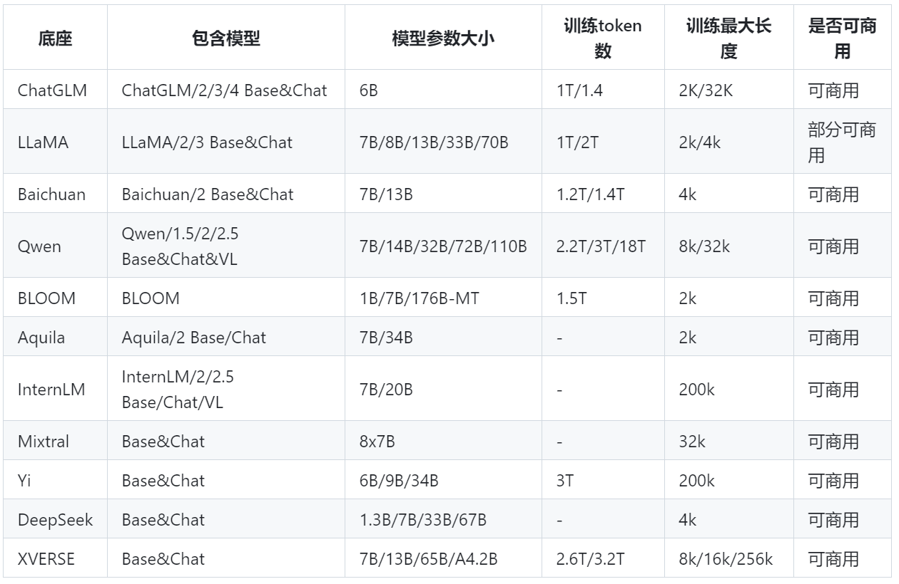

## 大模型和未来AI（理论和实际应用结合）

>**author@ zhaxinji**

-----------

### 人工智能发展经历的四个关键阶段
- 弱人工智能（基于规则）
- 统计机器学习
- 深度学习
- 大语言模型
<p style="">目前，大模型已在众多垂直领域有了较深入的应用，比如科技，教育，医疗，法律，金融，农业等
<p style="">医疗方面应用举例：

- DoctorGLM：一个基于 ChatGLM-6B的中文问诊模型，通过中文医疗对话数据集进行微调
- BianQue：一个经过指令与多轮问询对话联合微调的医疗对话大模型，使用中文医疗问答指令与多轮问询对话混合数据集进行微调
- XrayGLM：一个会看胸部X光片的中文多模态医学大模型，其在医学影像诊断和多轮交互对话上显示出了非凡的潜力
<p style="">从传统的深度学习时代全面过渡到大模型时代已经势不可挡，并在加速演进
<p style="">具有强大能力的大模型是迈向通用人工智能的关键一步

-----------

### 大模型的起源和雏形(GPT-1)
<p style="">GPT-1是一个可扩展，与任务无关的通用预训练模型
<p style="">通过预训练（无监督学习）+ 微调（有监督学习）的方式，在多个自然语言研究任务中刷新了最先进研究水平，达到SOTA
<p style="">追根溯源，因此基于微调的方式也成为了目前大模型应用的最主流范式

-----------

### 基于大模型通用微调方法的的一般训练步骤
<p style="">（1）选择合适的基底（基座）模型
<p align="center" style="zoom:60%;">

</p>
<p style="">（2）将特定任务的数据集处理成上面选择的基底模型适合的数据输入格式
<p style="">（3）调整原始模型的结构（通常与选择的通用微调方法有关）
<p style="">（4）训练微调模型并保存训练后的权重
<p align="center" style="zoom:60%;">

</p>
<p style="">个人意见：单张GPU显存不低于24G，否则微调训练时间会很长，具体需求视情况而定（跟选择的基底模型和训练设置等都有关）
<p style="">（5）对微调后的模型进行评估和调整
<p align="center" style="zoom:30%;">

</p>

-----------

### 具有代表性的通用微调方法
<p align="center" style="zoom:60%;">

</p>
<p style="">（1）BitFit微调：其核心思想是只微调模型中的偏置项，而保持其它参数固定不变。偏置项是每层神经元的额外参数，通常较少，它们的作用是调整神经元的输出来帮助神经网络学习到更加复杂的模式，而不是决定层之间的连接关系。因此，偏置项的调整不会大规模影响模型的结构。通过调整这些偏置项，模型可以更加适应特定任务，达到微调的效果。
<p align="center" style="zoom:60%;">

</p>
<p style="">（2）Prefix微调：其核心思想是仅对模型的输入嵌入部分进行微调，而保持模型的其它部分固定不变。其通过添加一个可学习的前缀嵌入来影响模型的输出，这些前缀嵌入通常是随机初始化的，并且具有固定长度。在训练过程中，前缀嵌入会作为可训练参数更新。对于具体任务，通过特定损失函数来对前缀嵌入进行优化。模型根据前缀嵌入学习到不同任务的目标。
<p align="center" style="zoom:60%;">

</p>
<p style="">（3）Prompt微调：传统的输入提示是人工设计的，而在Prompt微调中，提示本身是可学习的参数。Prompt微调的创新之处在于，提示不再是固定的文本，而是可训练的参数或向量。在训练阶段，固定预训练模型的权重，仅训练Prompt的参数，通过训练数据来优化这个Prompt。
<p align="center" style="zoom:60%;">

</p>
<p style="">（4）Adapter微调：其核心思想是在模型的各个层插入小型的适配器模块，通过这种方式，可以在不改变原有权重的情况下，通过适配器模块适应不同的任务。通常是一个小型的全连接网络，位于Transformer层之间，用来调整经过自注意力机制和前馈网络的中间表示。
<p align="center" style="zoom:60%;">

</p>
<p style="">（5）Lora微调：其核心思想是通过引入两个低秩矩阵（A,B) 来替代原始权重矩阵的更新，这两个低秩矩阵的秩远小于原始矩阵的秩，从而减少了计算和存储开销。最后Lora会将原始权重矩阵与两个低秩矩阵的乘积 (AXB) 相加，从而获得调整后的权重。
<p align="center" style="zoom:60%;">

</p>
<p style="">此外，还有其它一些通用微调方法，比如P微调等

-----------

### 除了通用的微调方法外，大模型还有许多其它的应用范式，比如
<p style="">（1）直接使用大模型提供的API服务，通常是使用超大规模的语言模型，参数量在数千亿甚至上万亿的模型
<p style="">下面是chatgpt4omini和国产qwen的简单使用示例代码：

```Python
# chatgpt pip install openai
import openai

openai.api_key = ""

def get_gpt_response(instruction, prompt):
    completion = openai.ChatCompletion.create(
        model='gpt-4o-mini', # gpt-3.5-turbo-0125
        messages=[
            {"role": "system", "content": instruction},
            {"role": "user", "content": prompt},
        ]
    )
    response = completion.choices[0].message.content
    # print(response)
    return response

instruction = "You are a helpful assistant."
prompt = ""
response = get_gpt_response(instruction, prompt)
print(response)
```
```Python
# qwen  pip install dashscope
from http import HTTPStatus
import dashscope

DASHSCOPE_API_KEY=""

messages = [{'role': 'system', 'content': 'You are a helpful assistant.'},
            {'role': 'user', 'content': ''}]

responses = dashscope.Generation.call(
    dashscope.Generation.Models.qwen_max,
    api_key=DASHSCOPE_API_KEY,
    messages=messages,
    result_format='message',
    stream=True,
    incremental_output=True
)

full_content = ''
for response in responses:
    if response.status_code == HTTPStatus.OK:
        full_content += response.output.choices[0]['message']['content']
        # print(response)
    else:
        print('Request id: %s, Status code: %s, error code: %s, error message: %s' % (
            response.request_id, response.status_code,
            response.code, response.message
        ))
print('answer:\n' + full_content)
```
<p style="">直接从huggingface上拉取开源大模型来直接使用其服务：
<p style="">文本大模型：

```Python
from transformers import AutoTokenizer
import transformers
import torch

model = "../Llama-3.2-1B"
tokenizer = AutoTokenizer.from_pretrained(model)

pipeline = transformers.pipeline(
    "text-generation",
    model=model,
    torch_dtype=torch.float16,
    device_map="auto",
)

sequences = pipeline(
    'I liked "Breaking Bad" and "Band of Brothers". Do you have any recommendations of other shows I might like?\n',
    do_sample=True,
    top_k=10,
    num_return_sequences=1,
    eos_token_id=tokenizer.eos_token_id,
    max_length=200,
)

for seq in sequences:
    print(f"Result: {seq['generated_text']}")
```
<p style="">多模态大模型：

```Python
import torch
from PIL import Image
from transformers import AutoModelForCausalLM, AutoTokenizer
import os

os.environ['CUDA_VISIBLE_DEVICES'] = '0'
MODEL_PATH = "./glm-4v-9b"

device = "cuda" if torch.cuda.is_available() else "cpu"

tokenizer = AutoTokenizer.from_pretrained(MODEL_PATH, trust_remote_code=True)

query = '识别图片内容'
image = Image.open("./1.jpg").convert('RGB')
inputs = tokenizer.apply_chat_template([{"role": "user", "image": image, "content": query}],
                                       add_generation_prompt=True, tokenize=True, return_tensors="pt",
                                       return_dict=True)

inputs = inputs.to(device)
model = AutoModelForCausalLM.from_pretrained(
    MODEL_PATH,
    torch_dtype=torch.bfloat16,
    low_cpu_mem_usage=True,
    trust_remote_code=True,
    device_map="auto"
).eval()

gen_kwargs = {"max_length": 2500, "do_sample": True, "top_k": 1}
with torch.no_grad():
    outputs = model.generate(**inputs, **gen_kwargs)
    outputs = outputs[:, inputs['input_ids'].shape[1]:]
    print(tokenizer.decode(outputs[0]))
```

<p style="">（2）利用大模型的强大推理和生成能力
<p style="">举例：基于推荐系统，根据原始基底模型来创建一个mini版本的大模型，然后使用创建的大模型来做用户和物品的Embedding生成器，参考代码如下：

```Python
import os
import json
import math
import torch
from tqdm import tqdm
import torch.nn.functional as F
from transformers import RobertaConfig, RobertaModel, RobertaTokenizer, AutoModel

# Initializing a RoBERTa configuration
configuration = RobertaConfig(num_hidden_layers=6, layer_norm_eps=1e-5, max_position_embeddings=514, type_vocab_size=1)
# Initializing a model (with random weights) from the configuration
small_model = RobertaModel(configuration).cuda()
# Accessing the model configuration
configuration = small_model.config
# Load the tokenizer
tokenizer = RobertaTokenizer.from_pretrained('./baseline_embedders/roberta-base')
# Load the Base model
base_model = AutoModel.from_pretrained("./baseline_embedders/roberta-base").cuda()
# Copy the weight of Base model
small_model.load_state_dict(base_model.state_dict(), strict=False)
# Save the model
small_model.save_pretrained('./baseline_embedders/roberta-small')
# Save the configuration
configuration.save_pretrained('./baseline_embedders/roberta-small')
# Save the tokenizer
tokenizer.save_pretrained('./baseline_embedders/roberta-small')

test_work = True

if test_work:
    eval_datas = ['sports', 'steam', 'yelp']
    for _dataset in eval_datas:
        user_profile, item_profile = {}, {}
        user_profile_list, item_profile_list = [], []
        with open(f'./data/{_dataset}/user_profile.json', 'r') as f:
            for _line in f.readlines():
                _data = json.loads(_line)
                user_profile[_data['user_id']] = _data['profile']
        with open(f'./data/{_dataset}/item_profile.json', 'r') as f:
            for _line in f.readlines():
                _data = json.loads(_line)
                item_profile[_data['item_id']] = _data['profile']

        for i in range(len(user_profile)):
            user_profile_list.append(user_profile[i])
        for i in range(len(item_profile)):
            item_profile_list.append(item_profile[i])

        profiles = user_profile_list + item_profile_list
        batch_size = 128
        n_batch = math.ceil(len(profiles) / batch_size)
        text_emb = []
        for i in tqdm(range(n_batch), desc=f'{_dataset}'):
            start = i * batch_size
            end = (i + 1) * batch_size
            batch_profile = profiles[start: end]
            inputs = tokenizer(batch_profile, padding=True, truncation=True, return_tensors="pt")
            for tem in inputs:
                inputs[tem] = inputs[tem].cuda()
            with torch.no_grad():
                embeddings = small_model(**inputs, output_hidden_states=True, return_dict=True).last_hidden_state[:, 0]
            embeddings = F.normalize(embeddings, dim=-1)
            text_emb.append(embeddings.cpu())
        text_emb = torch.concat(text_emb, dim=0)
        user_emb = text_emb[: len(user_profile)].numpy()
        item_emb = text_emb[len(user_profile):].numpy()
```
<p style="">（3）自定义的微调方式，内容较多（根基）
<p style="">首先是我自己构建了一个基于深度学习的通用项目代码模板，主要是基于推荐系统实现的，充分考虑了多种场景下的写法，项目结构如下：

- dataset：存放原始数据集，及预处理后的各种数据集形式和其它相关数据等
- main.py：项目主干，使得各项准备工作，数据预处理，模型训练，评估等阶段结构清晰
- parser.py：以命令行解析，装饰器或外部注入的形式对超参数抽取封装
- utils.py：各种常用工具函数封装
- dataHandler.py：数据处理类，对常见的各种数据处理方法进行封装
- model.py：定义模型，完成初始化和前向传播过程（考虑多种常见的推荐中深度神经网络结构）
- coreMethod.py：项目核心方法封装，比如自定义优化器，各种损失函数，数据增强方法等
- evaluation.py：模型性能评估，含各种常见指标计算方法
- README.md：项目说明文档
- run.sh：项目运行脚本入口
<p style="">上面代码结构和内容需要根据具体的应用场景做相应调整
<p style="">自定义的微调方式就是将传统的基于深度学习的重要思想应用到大模型的微调训练中，真正做到大小模型协同作战，使其能够更适应特定任务，此部分所涉及的内容很多，且灵活性很大，不同的大模型结构和训练过程也存在偏差，难度较大，无法形成统一的方式

-----------

### 目前，绝大部分前沿的大模型都是基于Transformer架构，主要有三类
<p style="">（1）仅编码器架构（代表模型BERT，RoBERTa等）
<p style="">（2）编码器-解码器架构（代表模型T5等）
<p style="">（3）仅解码器架构（代表模型GPT系列等）
<p style="">以GPT2和Llama模型为例：

<p align="center" style="zoom:60%;">

</p>

<p align="center" style="zoom:30%;">

</p>

-----------

### MOE架构
<p style="text-indent: 2em;">除Transformer架构外，还有一种流行架构就是MOE架构，其基本思想是将一个大模型分为多个专家组件，每个专家是一个独立的子模型，能够对输入数据进行特定处理。根据输入数据的不同，MOE架构选择性地激活一个或多个专家，或者通过组合多个专家模型来解决一系列的复杂任务，而不是所有的任务都交给统一的大模型来解决，这样可以显著减少计算量和内存消耗。

-----------

### 大模型开发的6个关键步骤
<p style="">（1）数据收集与处理：大模型的训练数据包括网页数据，代码，书本，科学知识等，这个阶段，需要收集大量文本数据，然后对数据做清洗，移除无关或低质量的内容，然后对数据进行预处理，如分词、去除敏感信息等。
<p style="">（2）模型设计：确定模型的架构，比如GPT系列采用的是Transformer的解码器架构，然后设定模型的大小，包括层数、隐藏单元数、参数总量等。
<p style="">（3）预训练
<p style="">（4）微调
<p style="">（5）奖励：这个阶段就像给模型设置了一个“激励机制”，通过奖励来让模型知道什么是好的回答或行为，通过这种方式，模型学会了更好地满足用户的需求，从而让模型更加专注于提供有价值、准确的回答，能够更好地适应用户的具体需求。
<p style="">（6）强化学习：最后这个阶段，模型就像在进行“实战演习”，通过不断的尝试和错误来学习怎样做得更好，在这个阶段，模型会在真实世界的复杂情境中尝试各种策略，找出最有效的方法。模型在这个阶段变得更加聪明和灵活，能够在复杂和不确定的情况下做出更好的判断和回答。

-----------

### 常见的大模型局限性体现
<p style="">（1）幻觉问题
<p style="">

- 模型在训练时可能过度拟合了训练数据中的噪声或错误信息，导致模型在生成时产生虚构的内容。
- 如果训练数据中未能充分覆盖各种真实场景，模型可能会在未见过的情况下产生虚构的信息。
- 模型未能有效地考虑生成信息的可信度，而是过于自信地产生表面上合理但实际上虚构的内容。
<p style="">（2）失忆问题
<p style="">

- 模型可能受到上下文记忆能力的限制，无法有效地保持和利用长期依赖的信息。
- 如果训练数据中缺乏长对话或复杂语境的例子，模型可能未能学到正确的信息保持和检索方法。
- 在长对话中，模型可能逐渐偏离初始话题，导致遗忘先前提到的关键信息。
<p style="">（3）生成不当内容问题
<p style="">

- 模型可能在训练数据中学到了不适当的观点、偏见或刻板印象，导致生成不当内容。
- 模型可能在训练数据中学到了不适当的观点、偏见或刻板印象，导致生成不当内容。
- 模型训练时未考虑伦理和社会责任问题，缺乏对不适当内容的抑制；
<p style="">（4）难以解决专业问题和垂直场景问题
<p style="">问题明显，不必赘述
<p style="">（5）复读机问题
<p style="">大语言模型在面对相同或相似的问题时，产生与先前看到的答案相似或重复的输出，这使得模型似乎陷入了一种“复读机”式的行为。

-----------

### RAG（检索增强生成），我们使用的在线生成式AI问答模型的背后机制，RAG实现检索问答的整个过程和原理
<p style="">（1）用户输入问题，通过编码器将其转换成Embedding
<p style="">（2）从向量数据库中获取跟这个问题相关的一些段落信息片段，向量知识库的构建通常是离线收集的知识库和实时联网检索获取处理的
<p style="">（3）将检索到的片段和问题合并，形成一个prompt
<p style="">（4）将prompt内容交给大模型，通过大模型执行回答，并以自然语言的方式输出回答结果

-----------

### 大模型压缩
<p style="">由于大模型变得越来越庞大，大模型压缩指的是通过一系列技术手段减小模型的大小和推理成本，同时尽量保持模型的性能和效果。随着大模型变得越来越庞大，压缩成为了降低资源消耗、提高推理速度和提升部署效率的一个关键技术。
<p style="">代表性方法：
<p style="">（1）模型剪枝：剪枝技术通过删除网络元素，包括从单个权重（非结构化剪枝）到更高粒度的组件，如权重矩阵的整行/列（结构化剪枝），这种方法通过识别和去除“冗余”部分来压缩模型。
<p style="">结构化剪枝相关论文：

- LLM-Pruner(LLM-Pruner: On the Structural Pruning of Large Language Models)
- LLM-Shearing(Sheared LLaMA: Accelerating Language Model Pre-training via Structured Pruning)
- SliceGPT: Compress Large Language Models by Deleting Rows and Columns
- LoSparse

非结构化剪枝相关论文：

- SparseGPT(SparseGPT: Massive Language Models Can be Accurately Pruned in One-Shot)
- LoRAPrune(LoRAPrune: Pruning Meets Low-Rank Parameter-Efficient Fine-Tuning)
- Wanda(A Simple and Effective Pruning Approach for Large Language Models)
- Flash-LLM(Flash-LLM: Enabling Cost-Effective and Highly-Efficient Large Generative Model Inference with Unstructured Sparsity)

<p style="">（2）知识蒸馏：知识蒸馏是一种将大型、复杂模型的知识迁移到小型模型的技术。通过训练一个较小的“学生”模型，让它模仿大型“教师”模型的输出。这样可以得到一个更加高效、占用资源更少的小模型，且尽量保持大模型的性能。
<p style="">（3）模型量化：量化是将模型中的浮点数（通常是32位或16位浮点数）转换为低精度的表示（如8位整数）。通过这种方式，可以显著减少模型的内存占用，并加速推理。

-----------

### 多模态大模型
<p style="">目前，已经开源了许多国产多模态大模型，可以根据具体任务需求选择，比如：
<p style="">VisualGLM-6B，CogVLM，Visual-Chinese-LLaMA-Alpaca，LLaSM，VisCPM，MiniCPM-V，Qwen-VL，InternVL/1.5/2.0

-----------
此外，还有大模型推理，优化，部署，测评等相关技术